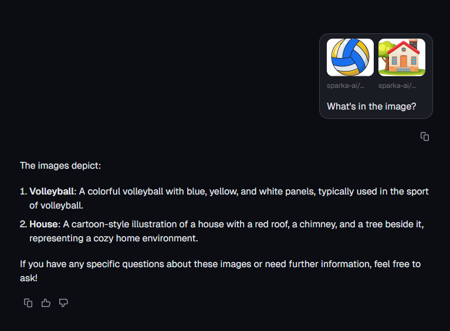
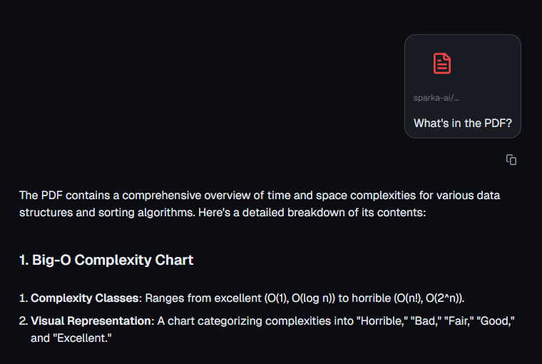
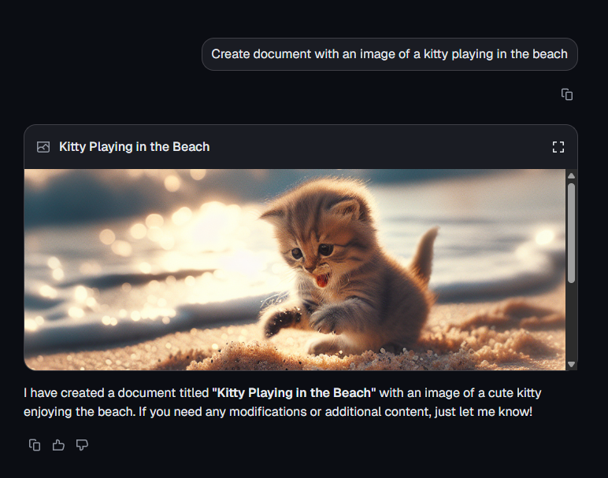
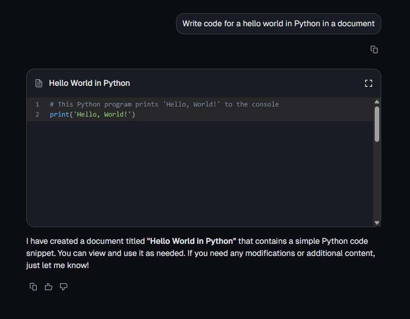
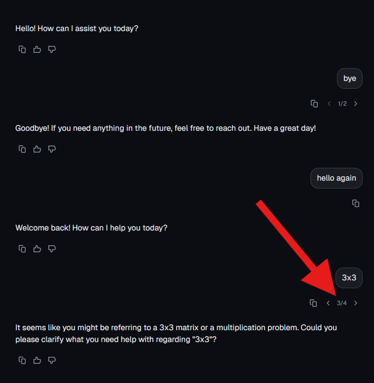
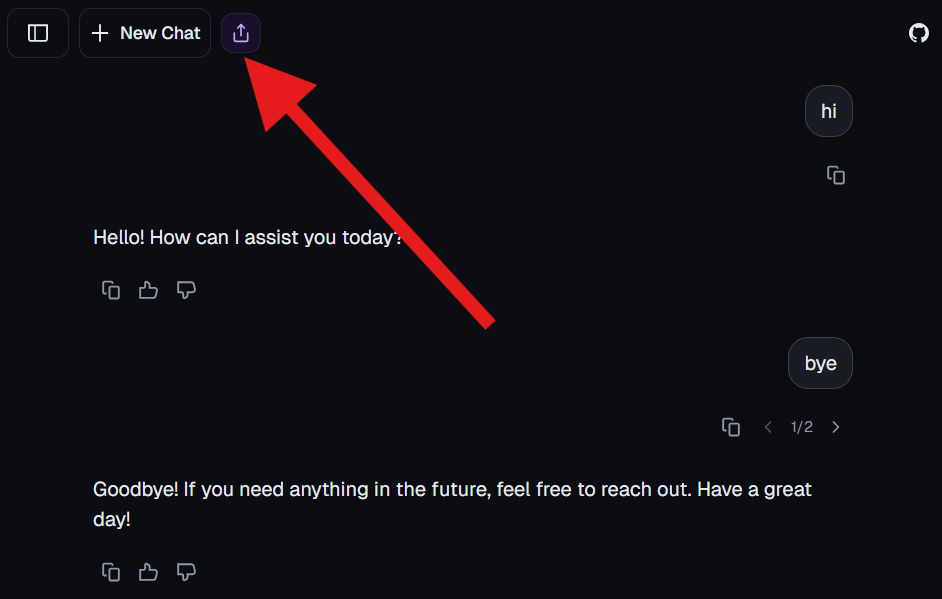
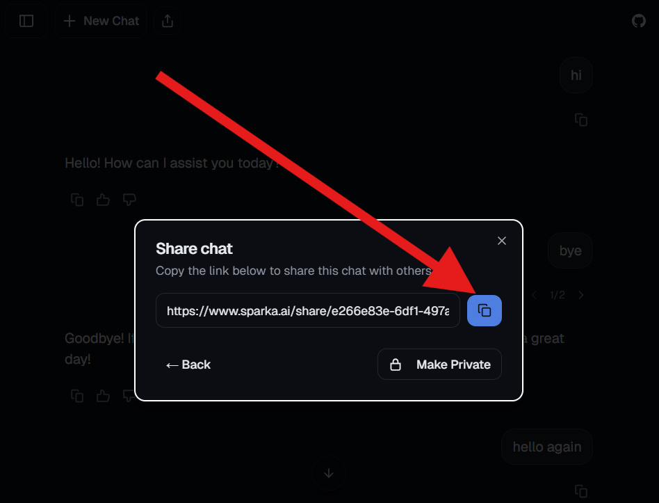
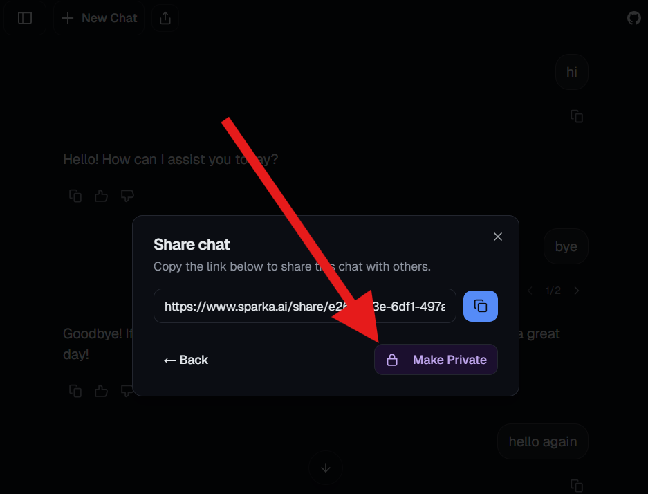
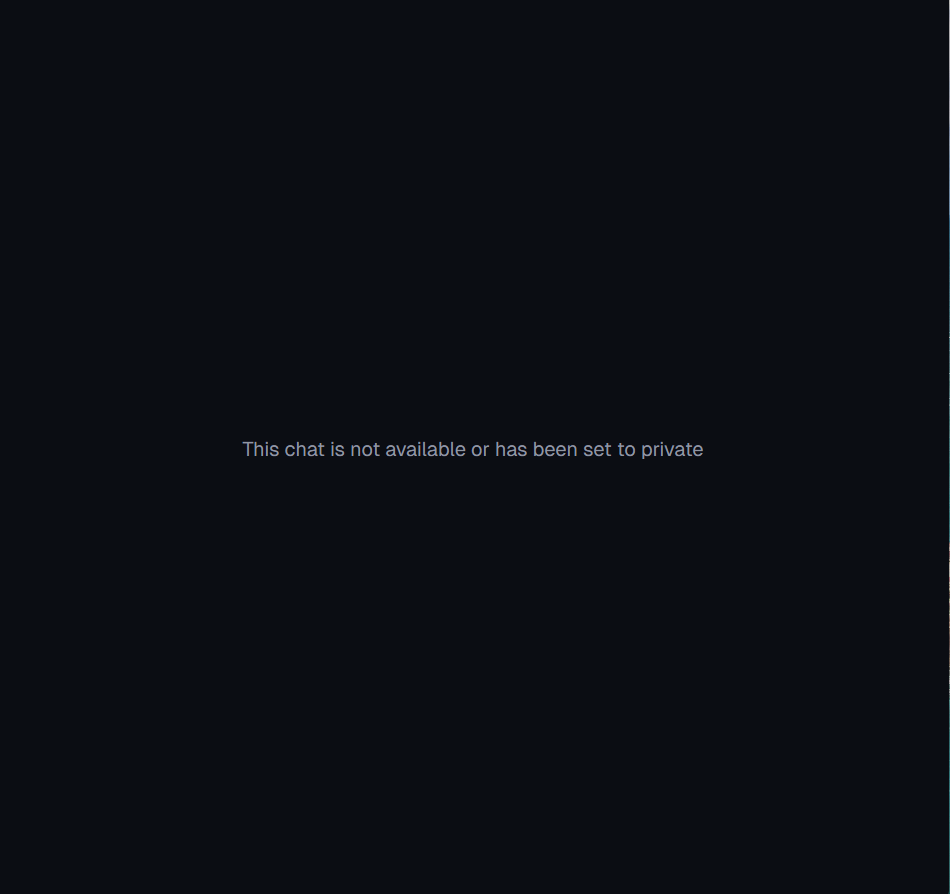
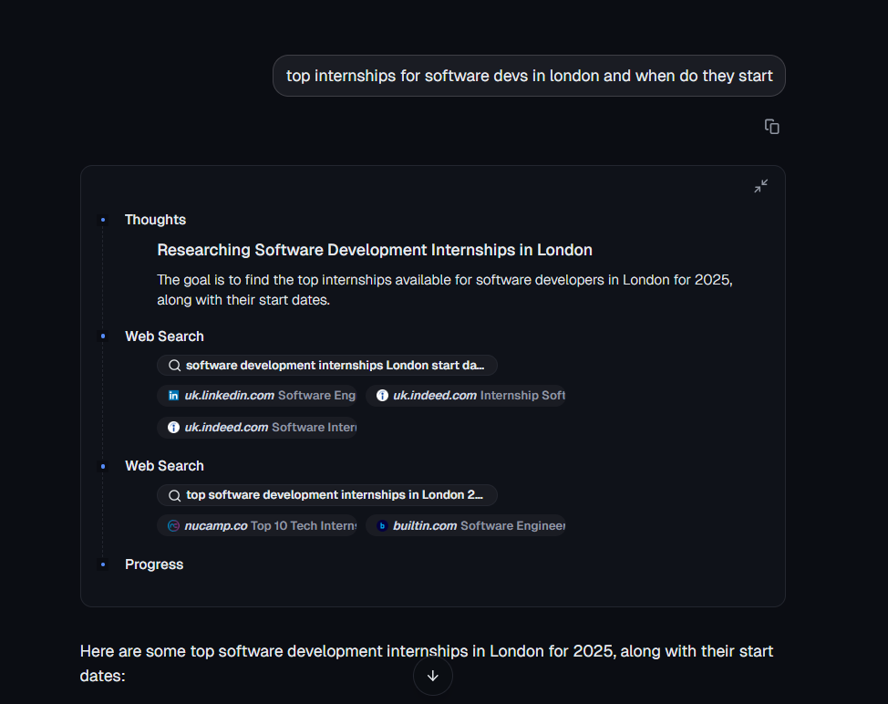

# Testing Instructions for Sparka Features

This document provides comprehensive testing instructions for all major features in the Sparka chat application.

## Prerequisites

1. Start the development server: `bun dev`
2. Navigate to `http://localhost:3000`

## 1. Attachment Support

### Testing Image Uploads
1. **Basic Image Upload and Multiple Attachments**:
   - Click the paperclip/attachment icon in the chat input
   - Select an image file (PNG, JPG, WebP)
   - Upload multiple files in a single message
   - Verify the image appears as a preview in the input area
   - Test removing individual attachments before sending
   - Send the message and verify the image displays correctly in the chat
   - Prompt: "What's in the image?"
   - Example: https://www.sparka.ai/share/6dd8f1d7-57d1-4f1c-8a44-30f04f09eb95
   

2. **PDF Upload**:
   - Click the attachment icon
   - Select a PDF file
   - Verify PDF preview appears
   - Send the message and verify PDF can be opened/viewed
   - Prompt: "What's in the PDF?"
   - Example:https://www.sparka.ai/share/2c8f35d3-67bc-4eec-8351-04eb2904d6a0
      
   

## 2. Image Generation Support

### Testing AI Image Generation
1. **Basic Image Generation**:
   - Prompt: "Create document with an image of a kitty playing in the beach"
   - Verify the AI generates and displays an image
   - Example:https://www.sparka.ai/share/3c69ed0f-249f-4d5b-a824-6e2458c6ccd7
   

## 3. Syntax Highlighting

### Testing Code Formatting
1. Promt: "Write code for a hello world in Python in a document"
   - Example:https://www.sparka.ai/share/9f1fc4b1-e738-4337-9344-f433a82b62f4
   

## 4. Resumable Streams

### Testing Stream Continuation
1. **Basic Stream Interruption**:
   - Start a conversation that generates a long response
   - Refresh the page mid-generation
   - Verify the response continues from where it left off
   - Example:

## 5. Chat Branching

### Testing Alternative Conversation Paths
1. **Create Branch and Switch Between Branches**:
   - In an existing conversation, edit any user message
   - Switch between branches with the branch selector
   - Navigate between different branches of the same conversation
   - Verify conversation history is maintained for each branch
   - When the conversion is loaded, the last message received is displayed
   - The message is attached to the right branch
   - Example:https://www.sparka.ai/share/e266e83e-6df1-497a-9b86-710e729e55b5
   

## 6. Chat Sharing

### Testing Conversation Sharing
1. **Generate Share Link**:
   - Click the share button in a conversation or in the history in the sidebar
   - Copy the generated share link
   - Example: 
      
2. **Access Shared Chat**:
   - Open the share link in a new browser/incognito window
   - Verify the conversation is viewable
   - The shared chats are read-only
   - Save the conversation as a logged in user or as anonymous user
   - Example: https://www.sparka.ai/share/e266e83e-6df1-497a-9b86-710e729e55b5
   F

3. **Share Link Management**:
   - Test disabling/revoking share links
   - Verify revoked links no longer work
   - Example: 

## 7. Web Search

### Testing Real-time Web Search
1. **Enable Web Search**:
   - Look for web search toggle in the interface
   - Enable web search for a conversation
   - Example: https://www.sparka.ai/share/5f5c1376-d41c-4d5b-bfe8-c304f5c4f7e1 

2. **Search Queries**:
   - Ask questions that would benefit from web search:
     - "What's the latest news about AI?"
     - "What's the weather in New York today?"
     - "What are the current stock prices for tech companies?"
    - Open the search info panel (above the assistant message)

## Links in prompt

- Prompt: "What's https://cloneathon.t3.chat?"
- https://www.sparka.ai/share/bcc91bb0-d255-4d2b-ac9a-d6a839f6248e

## 8. Edit Message Plus

### Testing Message Editing
1. **Basic Message Edit**:
   - Click on any sent message
   - Verify edit interface appears
   - Modify the message text and save
   - Verify the conversation updates accordingly

**Editable Message Properties**:
   - Attachments (add/remove/modify)
   - Model Selection
   - Search toggles (web search, deep research)
   - Message content
   - Verify all changes regenerate the response correctly

